<h1 align="center">All Asmaul Husnain · Mugdho</h1>

  <strong>AI Engineer · Builder · Computer Science Student</strong> 
  I build practical software, explore AI systems, and contribute to open source.

  <a href="https://github.com/MugdhoAI">GitHub</a>
  ·
  <a href="mailto:allasmaulhusnain715@gmail.com">Email</a>

<table>
  <tr>
    <td width="46%" valign="top">
      
    </td>
    <td width="54%" valign="top">
      
    </td>
  </tr>
</table>

  AI engineering · developer tooling · automation · databases · open source

  

## What I build

I like turning ideas into working software, from AI applications and database tooling to developer utilities, automation, and interactive systems.

My current focus includes:

- **AI & intelligent applications** — Python, Azure AI, LangChain
- **Developer tooling** — CLI applications, validation, testing, automation, CI/CD
- **Systems & data** — databases, APIs, input validation, defensive programming
- **Interactive software** — real-time visualization and computer-vision experiments
- **Cloud & deployment** — Azure, Google Cloud, Netlify

## Open source

I work on existing codebases as well as my own projects: understanding unfamiliar code, fixing concrete problems, adding regression coverage, and responding to maintainer feedback.

| Contribution | What I worked on |
| --- | --- |
| [Soup #1243](https://github.com/MakazhanAlpamys/Soup/pull/1243) · **merged** | Fixed Transformers 5 `BatchEncoding` handling in sequence distillation and added regression coverage |
| [Soup #1053](https://github.com/MakazhanAlpamys/Soup/pull/1053) · **merged** | Fixed Rich markup handling for user-controlled model names and added regression coverage |
| [Provena #182](https://github.com/rajfirke/provena/pull/182) · **merged** | Added regression coverage for the top-level CLI commands exposed in help output |
| [pycubrid #378](https://github.com/cubrid-lab/pycubrid/pull/378) · **open** | Added strict positive-integer validation for `Cursor.arraysize` across sync and async cursors |
| [cubrid-mcp-server #1](https://github.com/MugdhoAI/cubrid-mcp-server/pull/1) · **open** | Fixed SQL comment handling in audit categorization with regression coverage |

The goal is simple: find a real problem, understand the existing implementation, make the smallest reliable change, and prove it with tests.

<!-- OPEN_SOURCE_START -->
<!-- OPEN_SOURCE_END -->

## Selected projects

### [SQLite in C](https://github.com/MugdhoAI/sqlite-c)
A small SQLite-style database engine built from scratch in C, covering SQL parsing, table operations, B-tree storage, paging, persistence, testing, benchmarking, and sanitizers.

### [Search Engine](https://github.com/MugdhoAI/search-engine)
A lightweight search engine built from scratch in Python with tokenization, an inverted index, TF-IDF ranking, Boolean queries, phrase search, JSON persistence, CLI support, tests, and CI.

### [pycubrid](https://github.com/MugdhoAI/pycubrid)
A Python DB-API 2.0 driver for CUBRID, with synchronous and asynchronous interfaces, SSL/TLS support, and extensive testing.

### [cubrid-mcp-server](https://github.com/MugdhoAI/cubrid-mcp-server)
An MCP server for working with CUBRID databases, with an emphasis on SQL safety, audit behavior, and reliable database tooling.

## Engineering approach

**Understand → change → test → verify → document.**

I care about software that is understandable, reproducible, and useful, not just code that happens to run once.

  The contribution Snake is refreshed automatically from GitHub's public contribution data.

