<p align="center">
  
</p>

<p align="center">
  
</p>

<p align="center">
  <a href="https://linkedin.com/in/mugdhoai"></a>
  <a href="https://github.com/MugdhoAI"></a>
  <a href="mailto:allasmaulhusnain715@gmail.com"></a>
  <a href="./assets/CV.pdf"></a>
</p>

<p align="center">
  
</p>

<br/>

## 👋 Who I Am

```json
{
  "name": "All Asmaul Husnain (Mugdho)",
  "role": "AI Engineer & Backend Developer",
  "passion": "Building useful things with code & intelligence",
  "specialization": ["Generative AI", "Azure AI/ML", "Scalable Systems"],
  "currently_learning": ["LangChain", "Advanced NLP"],
  "projects": ["Solyn (Founder)", "Virtual Farm (AI-Agriculture)", "ApplyFixer (AI Resume Tool)"]
}
```

## 🚀 My Ecosystem

**Core & Frameworks**


**Cloud & DevOps**


<br/>

## 📊 Stats & Activity

<p align="center">
  
  
</p>

<p align="center">
  
</p>

<br/>

## 🌾 Featured Projects

<p align="center">
  <a href="https://github.com/MugdhoAI/virtual-farm">
    
  </a>
  <a href="https://github.com/MugdhoAI/interactive-dna">
    
  </a>
  <a href="https://github.com/MugdhoAI/3D-Particle-System">
    
  </a>
</p>

<p align="center"><em>Virtual Farm is live → <a href="https://virtualfarm.netlify.app">virtualfarm.netlify.app</a></em></p>

<br/>


