<h3 align="center">mugdhoAI · terminal profile</h3>

  

 

<table>
  <tr>
    <td width="392.3" valign="top">
      
    </td>
    <td width="457.7" valign="top">
      
    </td>
  </tr>
</table>

 

Generated from self-contained SVGs · contribution data comes directly from GitHub's public contribution calendar.
