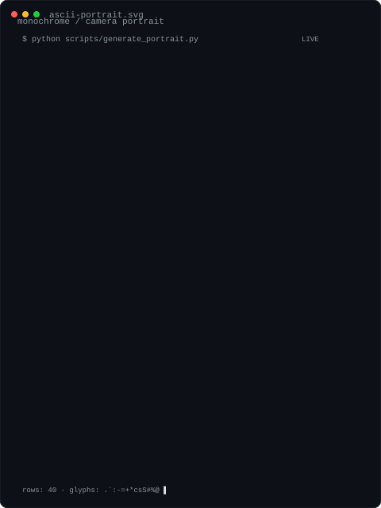
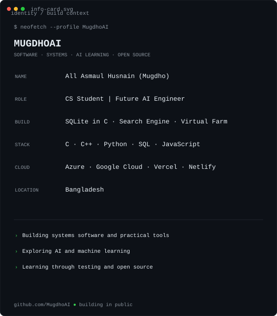

<h1 align="center">All Asmaul Husnain · Mugdho</h1>

  <strong>CS Student · Future AI Engineer · Builder</strong> 
  I build practical software, study computer science, and contribute to open source.

  <a href="https://github.com/MugdhoAI">GitHub</a>
  ·
  <a href="https://www.linkedin.com/in/mugdhoai/">LinkedIn</a>
  ·
  <a href="mailto:allasmaulhusnain715@gmail.com">Email</a>

<table>
  <tr>
    <td width="46%" valign="top">
      
    </td>
    <td width="54%" valign="top">
      
    </td>
  </tr>
</table>

  C · C++ · Python · Databases · Search · AI and ML · Open source

  

## What I build

I enjoy taking an idea or a real problem and turning it into working software. My projects focus on systems, databases, information retrieval, practical applications, and open source contributions as I continue learning AI and machine learning.

My current focus is:

- **Systems and software**: C, C++, data structures, databases, APIs
- **Algorithms and information retrieval**: indexing, Boolean search, TF IDF ranking
- **AI and ML**: Python, LangChain, Azure AI, AI agents
- **Developer tools**: CLI applications, testing, validation, automation, CI
- **Cloud and deployment**: Azure, Google Cloud, Netlify, Vercel

## Open source

I contribute to existing codebases by learning the surrounding implementation, solving concrete issues, adding tests, and responding to maintainer feedback.

| Contribution | What I worked on |
| --- | --- |
| [Soup #1243](https://github.com/MakazhanAlpamys/Soup/pull/1243) · **merged** | Fixed Transformers 5 BatchEncoding handling in sequence distillation and added regression coverage |
| [Soup #1053](https://github.com/MakazhanAlpamys/Soup/pull/1053) · **merged** | Fixed Rich markup handling for user controlled model names and added regression coverage |
| [Provena #182](https://github.com/rajfirke/provena/pull/182) · **merged** | Added regression coverage for top level CLI commands exposed in help output |
| [cubrid-mcp-server #1](https://github.com/MugdhoAI/cubrid-mcp-server/pull/1) · **merged** | Fixed SQL comment handling in audit categorization with regression coverage |
| [pycubrid #378](https://github.com/cubrid-lab/pycubrid/pull/378) · **open** | Added strict positive integer validation for Cursor.arraysize across sync and async cursors |

My approach is simple: find a real problem, understand the existing code, make a focused change, test it, and verify the result.

## Selected work

### [SQLite in C](https://github.com/MugdhoAI/sqlite-c)
A small SQLite style database engine built from scratch in C, covering SQL parsing, table operations, B tree storage, paging, persistence, testing, benchmarking, and sanitizers.

### [Search Engine](https://github.com/MugdhoAI/search-engine)
A lightweight search engine built from scratch in Python with tokenization, an inverted index, TF IDF ranking, Boolean queries, phrase search, JSON persistence, CLI support, tests, and CI.

### [Virtual Farm](https://virtualfarm.netlify.app/)
An interactive farming decision simulator built around one idea: test important decisions before real money is at stake.

### [Vault API](https://github.com/MugdhoAI/vault-api)
A REST API project focused on secret management, authentication, and access control.

### [AI Agents Guide](https://mugdhoai.github.io/ai-agents-guide/)
A practical guide to setting up and working with AI coding agents, writing useful prompts, and getting reliable results.

## How I work

**Understand → build → test → verify → document**

I care about understanding why something works, not just getting it to run. I prefer simple architecture, useful tests, clear documentation, and projects that solve a real problem.

  The contribution Snake is refreshed automatically from GitHub's public contribution data.

